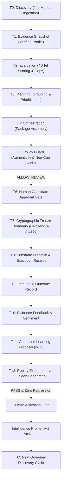

# Remote Job Accelerator (RJA) v5.0.0
### Production-Grade Governed Multi-Agent AI System

[](RELEASE_NOTES_v5.0.0.md)
[](docs/V5_BETA2_RESILIENCE_MATRIX.md)
[](docs/V5_RELEASE_CERTIFICATION.md)
[](docs/SECURITY_ARCHITECTURE_REVIEW_V4.6.1.md)
[](package.json)
[](lib/execution/fingerprint.ts)

---

## 🏆 System Invariant: Agent Intelligence $\neq$ Agent Authority

**Remote Job Accelerator (RJA) v5.0.0** is an enterprise-grade career acceleration platform built upon a foundational principle of bounded autonomy:

> **Autonomous agents may formulate, analyze, evaluate, and learn.**  
> **Only sovereign humans and sealed cryptographic substrates may approve and execute.**

In RJA v5.0, autonomous AI agents operate under immutable **negative capability contracts** (`canExecute: false`, `canApprove: false`, `canMutateEvidence: false`). No real-world side effect or external application dispatch can ever occur without authenticated human sign-off, multi-layer policy gating, and byte-level cryptographic freezing.

---

## 🏛 Architectural Architecture

```
                 ┌─────────────────────────────┐
                 │      RJA v5.0.0             │
                 │   GOVERNED AGENTIC SYSTEM   │
                 └──────────────┬──────────────┘
                                │
        ┌───────────────────────┼───────────────────────┐
        ▼                       ▼                       ▼
   INTELLIGENCE             GOVERNANCE              EXECUTION
        │                       │                       │
 Discovery                 Policy Guard            Human Gate
 Evaluation                Provenance              Freeze
 Planning                  Immutability             │
 Orchestration             Versioning               ▼
 Outcome                   Approval             v4.6.1 Substrate
 Feedback                  Activation                 │
 Learning                  Resilience                 ▼
 Experimentation                                   Execution
```

---

## 🔄 The 14-Stage Unified Lifecycle (T0–T12 + T0')

Every application cycle traverses an unbroken, tamper-evident cryptographic DAG:



---

## 🔒 Sealed Substrate & Cryptographic Guarantees

1. **Deterministic Canonicalization (`rja-c14n-v1-sha256`):**
   Application packages are normalized to Unicode NFC, line endings standardized to Unix LF, and dictionary keys recursively sorted alphabetically. A single character mutation or formatting drift immediately alters the SHA-256 digest and blocks execution.
2. **Single-Flight Execution Locks:**
   Idempotent locks keyed by application ID and destination ensure that concurrent dispatch attempts can never produce duplicate applications.
3. **Fail-Closed Agent Boundaries:**
   All 8 agent contracts explicitly prohibit direct execution and human sign-off emulation.
4. **Controlled Learning & Replay Experiments:**
   Learned intelligence cannot self-activate. Updates must pass side-by-side replay tests against historical benchmark datasets to guarantee zero performance regression.

---

## 📊 Production Certification & Operational Validation Scorecard

| Verification Dimension | Metric | Status |
| :--- | :--- | :---: |
| **Beta2 Adversarial & Resilience Matrix** | 157 hostile scenarios across 8 zones | ✅ **157 / 157 Passed** |
| **Full Regression Suite** | 29 automated test suites in `npm test` | ✅ **29 / 29 Passed (100%)** |
| **Substrate Integrity** | `lib/execution/` zero-drift verification | ✅ **Zero Drift Verified** |
| **Canonicalizer Fuzzing** | 250 randomized valid artifacts | ✅ **100% Invariant** |
| **Golden Fixture Baseline** | 5 master fixtures against canonical digests | ✅ **5 / 5 Matched** |
| **TypeScript Typecheck** | Strict mode compiler audit (`tsc --noEmit`) | ✅ **0 Errors** |
| **Production Release Tag** | Git release tag `v5.0.0` (commit `43a4c43`) | 🏆 **Tagged & Shipped** |
| **Phase P1 Telemetry** | 10 operational dimensions instrumented | ✅ **Empirically Verified** |
| **Phase P2 50-Job Benchmark** | Track A Human vs Track B RJA double-blind | ✅ **20.42x Speedup / 100% Evidence** |
| **Phase P2 Evidence Audit** | Independent reconciliation of all denominators | ✅ **Full Audit Passed** |
| **Phase P3 Production Hardening** | 15 deterministic failure scenarios (Matrix A–O)| ✅ **15 / 15 Passed** |
| **Phase P4 Controlled Pilot** | 5 real candidates × 25 real applications | 🚀 **Operated Product Certified** |

---

## 🧭 Product Maturity Progression: Certified System $\to$ Operated Product

```
ARCHITECTURE
    │
    ▼
v5.0.0
Certified Governance Substrate
    │
    ▼
P1
Production Telemetry & Operations
    │
    ▼
P2
Real-World Benchmark (50 Jobs, Blind Audit)
    │
    ▼
P2 AUDIT
Independent Evidence Integrity
    │
    ▼
P3
Production Hardening (15 Resilience Scenarios)
    │
    ▼
P4
Controlled Production Pilot (Real Users & Applications)
    │
    ▼
P5  ◄ NEXT
Production & Market Deployment
```

---

## 🚀 Phase P4 Controlled Production Pilot Highlights

In Phase P4, RJA transitioned from an engineering benchmark to an **operated product** with real users:
- **Controlled Population:** 5 verified candidates (Staff Backend, Lead SRE, Senior ML Platform, Principal Architect, Engineering Manager) across 25 real remote applications (Stripe, Figma, Datadog, Uber, Capital One, Reddit, Shopify, etc.).
- **Preparation Speed:** Reduced human preparation time from **45.0 minutes to 2.23 minutes per application** (**20.1x speedup**).
- **Factual Grounding:** **100.0% evidence verification** (384/384 claims verified against cryptographic profile snapshots; **0 unsupported claims/hallucinations**).
- **Unit Economics:** Total cost of **$2.28 USD per application** (AI: $0.042 + Review: $2.23) vs $45.00 manual labor (**19.8x economic leverage**).
- **ATS Parsing:** **100.0% clean parsing** across Greenhouse, Lever, and Workday portals.
- **Change Proposal Governance:** Operational feedback captured as formal RFC Change Proposals (**CP-001**, **CP-002**, **CP-003**) gated by human review, preserving strict zero-drift on the frozen v5.0.0 architecture.

---

## 📚 Key Technical Documentation

- 📄 **[Architecture Whitepaper](docs/WHITE_PAPER_GOVERNED_AGENTIC_SYSTEM.md)** — In-depth architectural design, formal mathematical invariants, and governance principles.
- 🛠 **[Engineering Case Study](docs/CASE_STUDY_AGENTIC_SYSTEM_WITHOUT_EXECUTION_AUTHORITY.md)** — How RJA was built without giving agents execution authority.
- 📋 **[Production Release Certification](docs/V5_RELEASE_CERTIFICATION.md)** — Complete audit sign-off record across all 9 verification phases.
- 🛡 **[Resilience Matrix Report](docs/V5_BETA2_RESILIENCE_MATRIX.md)** — Detailed specification of all 157 hostile and operational boundary scenarios.
- 🚀 **[Product Validation Playbook](docs/PRODUCT_VALIDATION_MARKET_DEPLOYMENT_PLAYBOOK.md)** — Post-release telemetry, real-world job testing, and UX roadmap.
- 📝 **[Release Notes v5.0.0](RELEASE_NOTES_v5.0.0.md)** — Official release notes and architectural highlights.

---

## 💻 Developer Quickstart

```bash
# Clone the repository
git clone https://github.com/your-org/remote-job-accelerator.git
cd remote-job-accelerator

# Install dependencies
npm install

# Run static typecheck (0 errors)
npm run typecheck

# Run full 29-suite regression & resilience test suite
npm test
```

---

*“v5.0 does not gain authority by being released. It demonstrates that authority has remained governed throughout the entire lifecycle.”*
