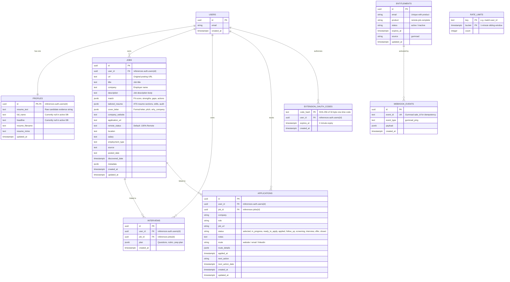
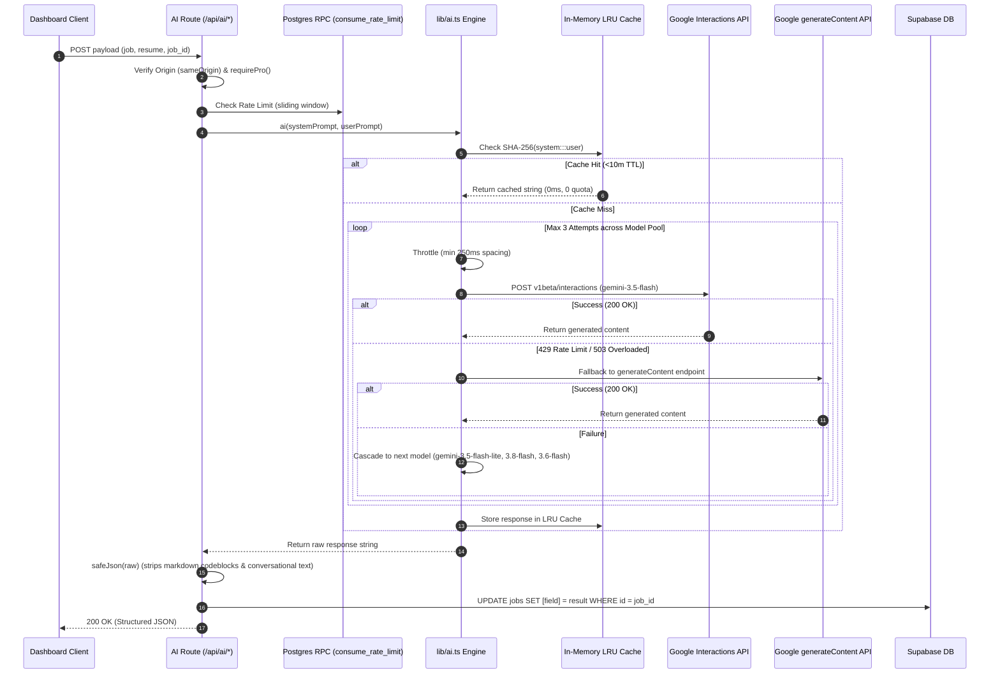
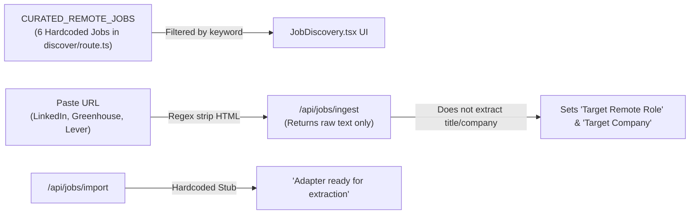
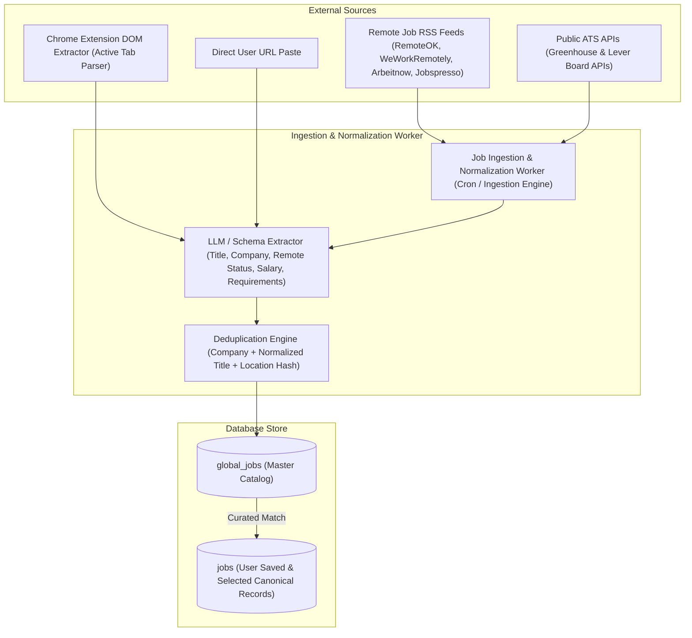

# Remote Job Accelerator (RJA) v4.3 — Architecture Map

This document details the actual system architecture, data models, component dependencies, and integration topology of RJA v4.3 as audited directly from the repository and live Supabase deployment.

---

## 1. High-Level System Topology

```mermaid
graph TD
    User["User Browser / Client"]
    Ext["Chrome Extension (v4.3 Manifest V3)"]
    Next["Next.js 16.3.5 Server (App Router + Turbopack)"]
    Proxy["Next.js Proxy / Middleware (proxy.ts)"]
    
    subgraph "Next.js 16 Server Architecture"
        Proxy --> AuthCheck["Session Token Verification (@supabase/ssr)"]
        Proxy --> SecurityHeaders["Security Headers (CSP, HSTS, X-Frame)"]
        Next --> AppPages["App Pages (/, /login, /signup, /dashboard)"]
        Next --> API["REST API Handlers (/app/api/*)"]
    end
    
    subgraph "Data & Persistence Layer"
        SupaAuth["Supabase Auth (auth.users)"]
        SupaDB[("Supabase PostgreSQL (public)")]
        RLS["Row-Level Security (RLS Policies)"]
    end
    
    subgraph "External Providers & Services"
        Gemini["Google AI Studio / Interactions API (gemini-3.5-flash)"]
        Gumroad["Gumroad Billing & Webhooks"]
        GoogleOAuth["Google OAuth 2.0 (Extension Auth)"]
        PostHog["PostHog Analytics (posthog.ts)"]
        ExtSites["Target Job Sites (LinkedIn, Greenhouse, Lever)"]
    end

    User -->|HTTP/HTTPS| Proxy
    Ext -->|Bearer JWT (15m)| API
    Ext -->|OAuth Flow| GoogleOAuth
    API -->|Service Role / Admin| SupaDB
    API -->|SSR Session| SupaAuth
    API -->|Failover Cascade| Gemini
    API -->|Ingest Fetch| ExtSites
    Gumroad -->|Ping Webhook (HMAC Secret)| API
    API -->|Telemetry Events| PostHog
```

---

## 2. Frontend Component Hierarchy & State Flow

```mermaid
graph TD
    Dashboard["Dashboard.tsx (Canonical State Container)"]
    
    subgraph "Dashboard Primary Views (MAIN_STEPS)"
        Step1["StructuredProfile.tsx (Step: Profile)"]
        Step2["JobDiscovery.tsx (Step: Job Discovery)"]
        Step3["UnifiedJobWorkspace.tsx (Step: Job Workspace)"]
        Step4["KanbanTracker.tsx (Step: Pipeline & Apply)"]
    end
    
    subgraph "UnifiedJobWorkspace Subtabs (WORKSPACE_TABS)"
        Sub1["Overview (Readiness Checklist + Job Description)"]
        Sub2["Match & Signals (Fit Score + Gap Analysis)"]
        Sub3["AtsResumeStudio.tsx (100% ATS Resume + TXT/MD/PDF Export)"]
        Sub4["ATS QC Engine (6-Point Truth & Compliance Audit)"]
        Sub5["Cover Letter & Pitch (Formal Letter + Direct Email Pitch)"]
        Sub6["InterviewSimulator.tsx (STAR Coach + Real-time Feedback)"]
        Sub7["Application Package (Executive Asset Compilation)"]
    end

    subgraph "Supporting & Disconnected Components"
        OppBar["OpportunityWorkspace.tsx (Active Job Switcher)"]
        Analytics["AnalyticsOverview.tsx (Velocity & Conversion)"]
        Orphan1["ActiveJobWorkspace.tsx (ORPHANED / UNUSED)"]
        Orphan2["OutreachEngine.tsx (DISCONNECTED FROM DASHBOARD UI)"]
    end

    Dashboard --> OppBar
    Dashboard --> Step1
    Dashboard --> Step2
    Dashboard --> Step3
    Dashboard --> Step4
    Step3 --> Sub1
    Step3 --> Sub2
    Step3 --> Sub3
    Step3 --> Sub4
    Step3 --> Sub5
    Step3 --> Sub6
    Step3 --> Sub7
    Step4 --> Analytics
```



### State Management & The Canonical `job_id` Backbone
1. **Root State Container**: `components/Dashboard.tsx` maintains:
   - `resume`: Raw string containing candidate master evidence text.
   - `jobs`: Array of `SavedJob` records retrieved from Supabase `jobs` table via `/api/workflow`.
   - `activeJobId`: UUID of the current selected canonical job.
   - `activeJob`: Memoized derive: `jobs.find(j => j.id === activeJobId) || jobs[0]`.
   - `apps`: Array of `Application` records from `/api/applications`.
   - `interviews`: Array of interview plans from `/api/workflow`.
2. **State Propagation**:
   - Every downstream workspace subtab (Match, Tailor, Cover, Interview, Package) binds to `activeJob.id`.
   - Updates mutate the in-memory `jobs` state array: `setJobs(prev => prev.map(x => x.id === activeJob.id ? { ...x, [feature]: result } : x))`.
3. **Identified State Vulnerability**:
   - When a user uploads a resume via `uploadFile(file)` in `Dashboard.tsx:147`, it executes `setResume(j.text)`. Because `/api/resume/upload` returns `{ saved: true, filename, characters }` and NOT `text`, in-memory `resume` state is corrupted to `undefined`.

---

## 3. Database Entity-Relationship Diagram (PostgreSQL)



---

## 4. AI Orchestration & Failover Cascade



---

## 5. Job Ingestion Architecture: Current State vs Production Target

### Current Audited Flow (Simulated / Stubs)


### Production Target Flow (Automated Pipeline)


---

## 6. Security Boundaries & Protection Topology

1. **Edge / Middleware Boundary (`proxy.ts`)**:
   - CSP: Restricts scripts to `'self' 'unsafe-inline' 'unsafe-eval'`; connect-src to `'self' https://*.supabase.co https://*.posthog.com`.
   - Framing: `X-Frame-Options: DENY`, `frame-ancestors 'none'` (Clickjacking immunity).
   - HSTS: `max-age=31536000; includeSubDomains; preload` on HTTPS.
   - Permissions-Policy: Disables camera, microphone, geolocation.
2. **Origin Validation (`lib/security.ts:sameOrigin`)**:
   - Compares request `origin` against `NEXT_PUBLIC_APP_URL`.
   - Enforced on all mutation routes (`/api/ai/*`, `/api/jobs/select`, `/api/applications`, `/api/resume/upload`, `/api/account/delete`).
3. **Database RLS & Isolation (`api/schema.sql`)**:
   - `profiles`: `auth.uid() = id`
   - `jobs`: `auth.uid() = user_id`
   - `interviews`: `auth.uid() = user_id`
   - `applications`: `auth.uid() = user_id`
   - `rate_limits` & `extension_oauth_codes`: Service-role only.
4. **Known Hardening Gaps (To be remediated)**:
   - Live Supabase instance missing table grants for `service_role` on `jobs`, `interviews`, `rate_limits`, `extension_oauth_codes`.
   - `sameOrigin` returns `true` if `origin` header is absent, allowing server-to-server or non-browser tooling without origin.
   - Rate limit calls missing `await` in several AI routes, bypassing rate limiting.
