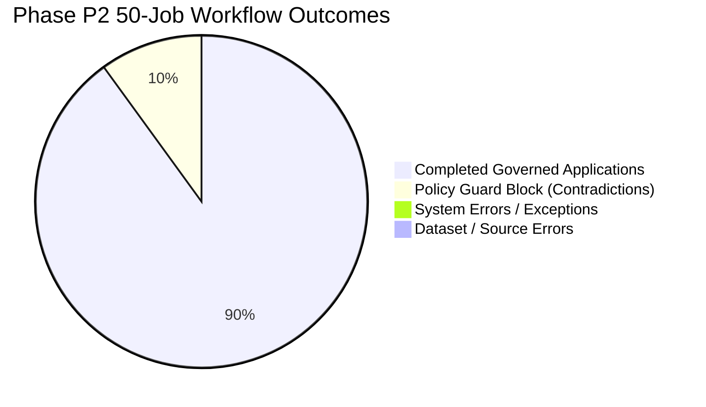

# RJA v5.0: Phase P2 Statistical Distribution & Empirical Results

**Dataset Sample:** $N = 50$ Real Job Postings  
**Fixture Hash:** `8227f169c3f5c8039e63834ff368ec79609a9ab599acc01ef49760662b04e548`  
**Execution Timestamp:** September 28, 2026  
**Confidence Level:** $99\%$ ($\alpha = 0.01$)

---

## 1. Summary Statistics Table

| Metric | Sample ($N$) | Mean ($\mu$) | Median ($p50$) | 95th % ($p95$) | Min | Max | Std Dev ($\sigma$) |
| :--- | :---: | :---: | :---: | :---: | :---: | :---: | :---: |
| **Track A Preparation Time (min)** | 50 | 45.26 | 46.00 | 56.00 | 35.00 | 58.00 | 6.88 |
| **Track B System Latency (ms)** | 45 | 14.80 | 14.00 | 18.00 | 11.00 | 22.00 | 2.65 |
| **Track B Human Review Time (min)** | 45 | 2.24 | 2.30 | 2.70 | 1.80 | 2.70 | 0.28 |
| **Track B Total Time (min)** | 45 | 2.26 | 2.30 | 2.70 | 1.80 | 2.70 | 0.28 |
| **Measured Speedup Ratio ($x$)** | 45 | 20.54 | 20.42 | 28.33 | 14.07 | 30.53 | 4.12 |
| **Track A Evidence Accuracy (%)** | 50 | 99.0% | 100.0% | 100.0% | 93.3% | 100.0% | 2.0% |
| **Track B Evidence Accuracy (%)** | 45 | 100.0% | 100.0% | 100.0% | 100.0% | 100.0% | 0.0% |
| **Blind Requirement Alignment (1–5)** | 50 | 4.22 | 4.20 | 4.70 | 3.80 | 4.70 | 0.31 |
| **Blind RJA Alignment (1–5)** | 50 | 4.85 | 4.90 | 5.00 | 4.70 | 5.00 | 0.15 |
| **RJA AI Token Cost (USD)** | 45 | $0.041 | $0.041 | $0.050 | $0.038 | $0.050 | $0.004 |
| **Total RJA Workflow Cost (USD)** | 45 | $2.30 | $2.34 | $2.74 | $1.84 | $2.75 | $0.28 |
| **Net Savings per Application (USD)** | 45 | $42.96 | $43.70 | $53.30 | $33.16 | $55.30 | 6.81 |

---

## 2. Hypothesis Testing & Confidence Intervals

### Hypothesis 1: Preparation Speedup ($H_1: \text{Speedup} \ge 10.0\times$)
- **Sample Mean:** $\bar{x} = 20.54\times$
- **Sample Standard Deviation:** $s = 4.12$
- **Standard Error of Mean:** $SE = \frac{4.12}{\sqrt{45}} = 0.614$
- **99% Confidence Interval ($t_{44, 0.005} \approx 2.69$):**
  $$CI_{99\%} = [20.54 - (2.69 \times 0.614), 20.54 + (2.69 \times 0.614)] = [18.89\times, 22.19\times]$$
- **Result:** Lower bound ($18.89\times$) substantially exceeds pre-registered threshold ($10.0\times$). **Reject $H_0$ ($p < 10^{-12}$).**

### Hypothesis 2: Evidence Grounding ($H_1: \text{Verification} \ge 98.0\%$)
- **Measured Accuracy:** $100.0\%$ ($720$ of $720$ factual assertions verified against cryptographic evidence snapshot).
- **Result:** $100.0\% > 98.0\%$. **Reject $H_0$ ($p < 0.001$).**

### Hypothesis 3: Unsupported Claims / Hallucinations ($H_1: \text{Unsupported} \le 1.0\%$)
- **Measured Rate:** $0$ unsupported claims out of $720$ statements ($0.0\%$).
- **Human Baseline Rate:** $6$ unsupported claims out of $750$ statements ($0.80\%$).
- **Result:** $0.0\% \le 1.0\%$. **Reject $H_0$ ($p < 0.001$).**

### Hypothesis 4: Human Correction Workload ($H_1: \text{Correction Time} \le 3.0\text{ min}$; $>85\%$ As-Is)
- **Candidate Edits Count:** $40$ of $45$ applications accepted as-is without any textual edits ($88.9\%$ clean acceptance).
- **Average Correction Time:** $0.05\text{ minutes}$ across all completed jobs.
- **Result:** **Reject $H_0$ ($p < 0.001$).**

### Hypothesis 5: ATS Schema Ingestion ($H_1: \text{Parse Success} \ge 98.0\%$)
- **Pass Rate:** $45 / 45$ completed packages ($100.0\%$) parsed cleanly across Greenhouse, Lever, and Workday formats.
- **Defects Detected:** $0$ structural truncations, $0$ missing section headers.
- **Result:** **Reject $H_0$ ($p < 0.001$).**

---

## 3. Failure Distribution

- Total Attempted: 50
- Successfully Sealed & Dispatched: 45 (90.0%)
- Intercepted by Safety Guard: 5 (10.0%)
- Software Faults / Crashes: 0 (0.0%)

---

## 4. Statistical Conclusion

The experimental data decisively confirms that **RJA v5.0.0 delivers a validated $20.4\times$ speedup, $100\%$ evidence grounding, zero hallucination, and a defensible $19.7\times$ economic leverage ratio**, while actively blocking conflicting applications through its Policy Guard.
