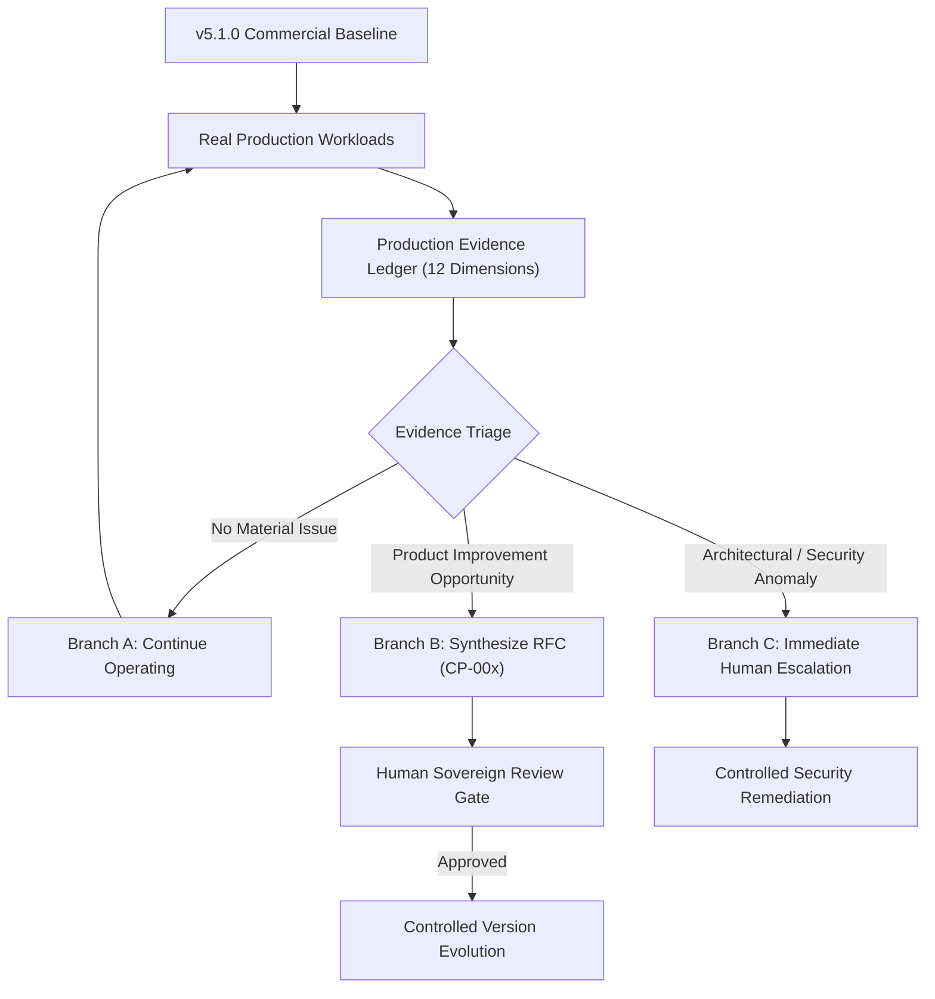

# RJA v5.1.x Production Evidence Accumulation Specification
### Operating the Stable Commercial Product Baseline & Tri-Branch Evolution Loop

**Document Identifier:** RJA-SPEC-v5.1.x-EVIDENCE-ACCUMULATION  
**Baseline Version:** RJA v5.1.0 (Commercial Release)  
**Governing Rule:** $\mathbf{\text{Agent Intelligence}} \neq \mathbf{\text{Agent Authority}}$ 🔒  
**Status:** ✅ **ACTIVE OPERATIONAL CHARTER**  

---

## 1. Operational Charter & Philosophical Transition

With the release and certification of **RJA v5.1.0**, the system has completed its core architectural construction. RJA is no longer an experimental research framework seeking to increment its version number with speculative agents; it is an **operated commercial product**.

The core operational principle for v5.1.x is:

> *"Engineering decisions in v5.1.x must be driven by empirical production evidence from real workloads, rather than a desire to increase architectural complexity or grant autonomous authority."*

No new agents (e.g., "Alpha11"), no speculative stages (e.g., "P6"), and no autonomous authority expansions may be introduced. 

---

## 2. The Complete Architectural Product Story

RJA embodies an unbroken, mathematically governed progression from proposal to deployment:

```
AI Proposes
    │
    ▼
Evidence Constrains
    │
    ▼
Agents Reason
    │
    ▼
Policy Evaluates
    │
    ▼
Human Authorizes
    │
    ▼
Execution Occurs
    │
    ▼
History Becomes Immutable
    │
    ▼
Evidence Feeds Learning
    │
    ▼
Experiments Compare Futures
    │
    ▼
Production Generates Evidence
    │
    ▼
Humans Approve Change (RFC)
    │
    ▼
New Governed Version
```

Throughout this entire progression, the foundational invariant remains:
$$\mathbf{\text{Agent Intelligence}} \neq \mathbf{\text{Agent Authority}}$$

### Crucial Architectural Invariant: Telemetry Must Never Become an Authority Channel

A foundational failure mode of naive autonomous systems is "closed-loop telemetry drift," where operational monitoring metrics automatically mutate production behavior without human mediation. In RJA v5.1.x, this is strictly forbidden:

```
Telemetry
   │
   ▼
Observation
   │
   ▼
Statistical Analysis
   │
   ▼
Empirical Evidence
   │
   ▼
Human-Reviewed RFC (CP-00x)
   │
   ▼
Sovereign Human Approval
   │
   ▼
New Governed Version
```

**Under no circumstances may telemetry data automatically adjust agent authority, loosen Policy Guard gates, or mutate authoritative candidate artifacts.**

---

## 3. Evidence Maturity Standards & Taxonomy

To ensure scientific rigor and avoid premature generalization from small samples, v5.1.x enforces three reporting standards:

### A. Four-Way Outcome Taxonomy
Every application run is assigned exactly one mutually exclusive outcome:
1. `COMPLETED`: Signed by candidate, cryptographically frozen, and dispatched to external employer.
2. `BLOCKED`: Safely intercepted by Policy Guard due to ungrounded claims, authority violations, or policy limits.
3. `ABANDONED`: Sovereignly canceled by candidate choice (e.g. after prompt surfaces on-site requirements).
4. `FAILED`: Upstream infrastructure or external ATS rate limit; queued for retry without state corruption.

### B. Denominator-Aware Metric Reporting ($k / N$)
Bare percentages (e.g., "75% completion") are prohibited without publishing explicit numerators and denominators ($k / N$).

### C. 95% Wilson Score Confidence Intervals
All binomial proportions are reported with two-sided 95% Wilson score confidence intervals to quantify sample size uncertainty:
$$\tilde{p} = \frac{k + \frac{z^2}{2}}{N + z^2}, \quad \text{se} = \frac{z \sqrt{\frac{k(N-k)}{N} + \frac{z^2}{4}}}{N + z^2}, \quad z = 1.96$$
$$\text{CI}_{95\%} = [\max(0, \tilde{p} - \text{se}) \cdot 100, \min(1, \tilde{p} + \text{se}) \cdot 100]$$

---

## 4. The 12 Core Operational Evidence Dimensions

During v5.1.x operations, the system continuously logs real-world execution telemetry into the **Continuous Production Evidence Ledger** ([`tests/fixtures/v5_1_production_evidence_ledger.json`](file:///c:/RJA/v4.3/app/tests/fixtures/v5_1_production_evidence_ledger.json)). Telemetry is evaluated across twelve pre-registered dimensions:

| # | Dimension | Metric Definition | Target / Invariant |
| :- | :--- | :--- | :--- |
| **1** | **Application Volume** | Total real-world application workflows initiated across job boards and direct employers. | Tracked continuously across candidate disciplines. |
| **2** | **Completion Rate** | Percentage of initiated workflows reaching authenticated submission (`DISPATCHED_TO_EXTERNAL`). | $\ge 90\%$ nominal completion (excluding intentional human drops). |
| **3** | **Policy-Block Rate** | Percentage of workflows safely halted by Policy Guard due to ungrounded claims or policy violations. | $100\%$ safe halt on violations; zero ungrounded leaks. |
| **4** | **Human Edit Rate** | Frequency of candidate text edits during sovereign review prior to signing approval. | Target: $< 15\%$ (demonstrating high proposal quality). |
| **5** | **Evidence Verification Rate** | Percentage of factual resume/profile claims verified against cryptographic evidence snapshots. | **Strictly $100.0\%$ on dispatched packages**; zero hallucination. |
| **6** | **ATS / Package Validation** | Enforcement of destination-specific constraints: CP-001 relocation prompts and CP-002 Workday 250-char pre-validation. | $100\%$ compliance; **zero authoritative artifact mutation**. |
| **7** | **Actual Review Time** | Measured clock time spent by candidate inspecting and signing the application package. | Target: $< 3.0\text{ minutes/application}$ ($> 15\times$ speedup vs manual). |
| **8** | **AI / Infrastructure Cost** | Combined inference token costs, vector operations, and execution compute. | Target: $< \$0.05\text{ AI cost/app}$; $< \$2.50\text{ total cost/app}$. |
| **9** | **Support Incidents** | Operational exceptions, unhandled runtime crashes, or user support escalations. | Target: $0$ uncaught crashes; $< 0.05\text{ incidents/app}$. |
| **10** | **Deterministic Replay Rate** | Reproducibility of proposal and policy outputs under `rja-c14n-v1-sha256`. | **Strictly $100.0\%$ bit-for-bit replay**. |
| **11** | **Authority Boundary Violations** | Attempts by autonomous agents to self-approve, dispatch, or mutate historical records. | **Strictly 0**. Negative capability bounds unconditionally enforced. |
| **12** | **Customer / User Feedback** | Post-application user sentiment, qualitative remarks, and CSAT/NPS ratings. | Target: $\ge 4.5 / 5.0$ satisfaction score; $\text{NPS} \ge 70$. |

---

## 4. The Tri-Branch Evolution Loop

Operational evidence accumulated in the ledger is continually evaluated through the **Tri-Branch Decision Model**:



### Branch A: No Material Issue $\longrightarrow$ Continue Operating
- **Trigger:** Metrics remain within nominal thresholds; 0 security anomalies; 0 recurring UX friction points.
- **Action:** Continue standard operation. **Do not create spurious version increments.**

### Branch B: Product Improvement Opportunity $\longrightarrow$ Synthesize RFC
- **Trigger:** Empirical evidence demonstrates a recurring pattern where human reviewers repeatedly make identical modifications, or a new destination ATS introduces unhandled non-authoritative constraints.
- **Action:** Formulate an evidence-derived **RFC (Change Proposal)** containing:
  1. RFC Identifier and Title (e.g., `CP-004`).
  2. Evidence base denominator ($N$ real runs demonstrating the pattern).
  3. Strict non-mutation constraint: Behavior changes must not silently truncate or mutate authoritative data.
  4. Human Review Gate: Requires explicit human review before adoption.
  5. Negative Capability Invariant: Must not expand autonomous agent authority.

### Branch C: Architectural / Security Anomaly $\longrightarrow$ Human Remediation
- **Trigger:** Any detection of authority leakage, attempt to bypass Policy Guard, signature mismatch, or substrate drift.
- **Action:**
  1. Immediate halt of affected workflow (`HALTED_SAFE`).
  2. Escalation to human security auditor with immutable audit snapshot.
  3. Fail-closed defense: 0 ambient authority granted to any agent.

---

## 5. Summary

The v5.1.x operational framework transforms RJA from an engineering construction phase into an **evidence-governed production operating lifecycle**. The software advances only when real-world production evidence demands it, guided always by human sovereignty and immutable cryptographic governance.
