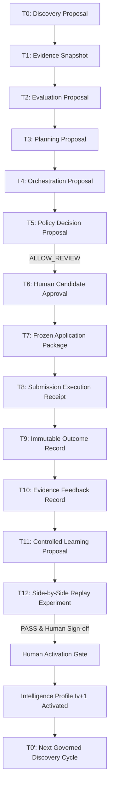

# Designing a Governed Agentic AI System: Architecture, Authority Boundaries, and Cryptographic Invariants in RJA v5.0

**Author:** Amaresh Das  
**Published:** September 2026  
**System Baseline:** Remote Job Accelerator (RJA) v5.0.0  
**Classification:** Production Engineering Whitepaper  
**Status:** Certified & Released (`v5.0.0`)

---

## Abstract

As generative artificial intelligence transitions from single-turn chat interfaces to autonomous multi-agent systems, the predominant failure mode shifts from factual hallucination to **uncontrolled authority delegation**. Common agent frameworks conflate *reasoning ability* with *execution permission*, granting autonomous agents direct API dispatch, state mutation, and self-approval capabilities. In high-consequence domains—such as career applications, enterprise workflow orchestration, legal submissions, and financial transactions—this conflation presents catastrophic operational, legal, and reputational risk.

This paper presents the architectural design, formal mathematical invariants, and production verification of **Remote Job Accelerator (RJA) v5.0**, a production-grade multi-agent platform founded upon a singular invariant:

$$\text{Agent Intelligence} \neq \text{Agent Authority}$$

In RJA v5.0, autonomous agents formulate strategies, discover opportunities, score multidimensional fit, construct application artifacts, and model historical feedback. However, all agent contracts enforce strict, immutable negative capabilities (`canExecute: false`, `canApprove: false`, `canMutateEvidence: false`). Execution is physically isolated behind a cryptographic freeze boundary (`rja-c14n-v1-sha256`) that requires authenticated, sovereign human cryptographic sign-off. Continuous self-improvement is achieved through closed-loop feedback and controlled learning, wherein candidate intelligence updates cannot self-activate and must pass deterministic replay experimentation against canonical benchmark datasets prior to human activation.

---

## 1. The Core Dilemma of Autonomous AI Agents

Modern AI agent architectures (e.g., ReAct, autonomous LangChain loops, AutoGPT-style executors) typically employ an unconstrained loop:

$$\text{Observation} \longrightarrow \text{Thought} \longrightarrow \text{Action} \longrightarrow \text{Direct Tool Execution}$$

While effective for isolated coding sandboxes or search queries, this architecture fails severely when deployed against external real-world systems:

1. **Runaway Execution Risk:** A hallucinated evaluation or loop failure triggers unreviewed external side effects (e.g., spamming 500 employer ATS portals with fabricated resumes).
2. **Authority Drift & Prompt Injection:** An adversarial job listing or prompt injection payload manipulates an agent into approving its own execution or bypassing organizational safeguards.
3. **Attribution Fabrication:** Without immutable provenance, systems cannot verify whether an action was authorized by the human principal or fabricated by autonomous sub-agents.
4. **Uncontrolled Self-Evolution:** Reinforcement learning or prompt tuning agents modify their own prompts or weights in production, causing performance regressions and unpredictable behavior drift.

### The Architectural Trilemma
In mission-critical agentic systems, three properties are routinely desired:
- **Autonomy** (high-level goal decomposition without manual micro-prompting)
- **Adaptability** (learning from outcomes and feedback)
- **Safety / Auditability** (zero unapproved side effects, zero historical tampering)

RJA v5.0 proves that the trilemma is resolved not by capping intelligence, but by **decoupling intelligence from authority**.

---

## 2. The Governed System Architecture

RJA v5.0 decomposes the career acceleration lifecycle into three strictly separated tiers:

```
┌─────────────────────────────────────────────────────────────────────────┐
│                       RJA v5.0 ARCHITECTURE                             │
├─────────────────────────────────────────────────────────────────────────┤
│                                                                         │
│  [TIER 1: INTELLIGENCE ENGINE]                                          │
│  Discovery → Evaluation → Planning → Orchestration → Outcome → Feedback │
│  Capabilities: Read snapshot, synthesize, propose, analyze, detect gaps │
│  Authority: canExecute: false, canApprove: false, canMutateEvidence: false│
│                                                                         │
│                            │ (Proposals Only)                           │
│                            ▼                                            │
│  [TIER 2: GOVERNANCE & POLICY GUARD]                                    │
│  Authenticity, Freshness, Consistency, Negative Capability Verification │
│  Policy Decision: ALLOW_REVIEW | REQUIRE_HUMAN_DECISION | BLOCK         │
│                                                                         │
│                            │ (Eligible Proposals)                       │
│                            ▼                                            │
│  [SOVEREIGN HUMAN BOUNDARY]                                             │
│  Authentic Human Cryptographic Signature Gate                           │
│                                                                         │
│                            │ (Signed Approval)                          │
│                            ▼                                            │
│  [CRYPTOGRAPHIC FREEZE BOUNDARY]                                        │
│  Canonicalization: rja-c14n-v1-sha256 (NFC Unicode, Key Sorting, LF)   │
│  FrozenArtifactPackage { fingerprint, immutable: true }                 │
│                                                                         │
│                            │ (Frozen Package)                           │
│                            ▼                                            │
│  [TIER 3: EXECUTION SUBSTRATE (v4.6.1 SEALED)]                          │
│  Single-Flight Locking (Idempotency) → Byte-Verification → Dispatch     │
│  Output: Cryptographic Submission Receipt                              │
│                                                                         │
│                            │                                            │
│                            ▼                                            │
│  [CLOSED-LOOP LEARNING & EXPERIMENTATION]                               │
│  Outcome → Evidence Feedback → Learning Proposal (Iv+1)                │
│  Replay Experiment vs Golden Benchmark → Regression Check              │
│  Human Activation Gate → Production Intelligence Evolution             │
└─────────────────────────────────────────────────────────────────────────┘
```

---

## 3. The 14-Stage Unified Lifecycle (T0–T12 + T0')

Every consequential action in RJA v5.0 follows an immutable DAG of cryptographic artifacts:



### Traceability Invariants
1. **Provenance Continuity:** Node $T_{k}$ cryptographically references the content digest of $T_{k-1}$.
2. **Snapshot Pinning:** All proposals within a lifecycle cycle bind to a unique `candidateSnapshotId` and `evidenceHash`. If candidate evidence changes mid-flight, all downstream proposals are invalidated.
3. **Execution Receipt Lock:** The execution receipt $T_8$ embeds the exact SHA-256 fingerprint verified at $T_7$. Any variance between the approved hash and the dispatched payload triggers an immediate hard abort.

---

## 4. Formal Mathematical & Cryptographic Invariants

### 4.1 Canonicalization & Fingerprinting Scheme (`rja-c14n-v1-sha256`)
Application packages (resumes, cover letters, custom screening answers) are transport-vulnerable payloads. A single whitespace difference or key order permutation must not produce false tampering alarms, yet any semantic alteration must be strictly detected.

Let $A$ be an application package payload. The canonicalizer function $C(A)$ maps $A$ into a normalized byte representation:

$$C(A) = \text{RESUME: } S(A_{\text{resume}}) \parallel \text{COVER: } S(A_{\text{cover}}) \parallel \text{ANSWERS: } \text{Sort}(A_{\text{answers}})$$

Where:
- $S(x)$ denotes recursive alphabetical key sorting with undefined field omission.
- $\text{Sort}(A_{\text{answers}})$ orders questions by normalized question identifier with deep tie-breaking.
- All strings are normalized to **Unicode Normalization Form C (NFC)** with canonical line endings (`\n`).

#### Formal Invariants Certified:
1. **Idempotency:** $\forall A: C(C(A)) = C(A)$
2. **Determinism:** $\forall A: \text{SHA256}(C(A))_1 = \text{SHA256}(C(A))_2$
3. **Representation Equivalence:** $\text{SHA256}(C(A_{\text{CRLF}})) = \text{SHA256}(C(A_{\text{LF}}))$ and $\text{SHA256}(C(A_{\text{NFD}})) = \text{SHA256}(C(A_{\text{NFC}}))$
4. **Representation Divergence:** Any $+1$ character, byte, codepoint, or metadata change guarantees $\text{SHA256}(C(A')) \neq \text{SHA256}(C(A))$.

### 4.2 Agent Negative Authority Contracts
Every agent in the registry operates under an immutable contract interface:

$$\text{Contract}_k = \langle \text{AgentID}, \text{AllowedOps}, \text{ProhibitedOps}, \text{CapabilityVector}, \text{StateScope}, \text{FailureBehavior} \rangle$$

All 8 agents enforce:
$$\text{CapabilityVector} = \begin{bmatrix} \text{canExecute} = \text{false} \\ \text{canApprove} = \text{false} \\ \text{canMutateEvidence} = \text{false} \end{bmatrix}, \quad \text{FailureBehavior} = \text{fail\_closed}$$

### 4.3 Controlled Intelligence Evolution
Intelligence profiles $I_v$ evolve through discrete version transitions:

$$I_{v+1} = \text{ApplyApprovedProposal}(I_v, P_{\text{learning}}, \text{Signature}_{\text{human}})$$

With the invariants:
1. $I_v$ is permanently immutable: $\text{Freeze}(I_v)$.
2. Lineage continuity: $\text{ParentVersion}(I_{v+1}) = I_v.\text{version}$.
3. Experimentation pre-condition: $P_{\text{learning}}$ cannot be applied unless:
   $$\text{RunReplayExperiment}(P_{\text{learning}}, I_v, I_{v+1}, D_{\text{benchmark}}).\text{overallStatus} = \text{'PASS'}$$
   $$\text{RegressionsDetected} = 0$$

---

## 5. Empirical Resilience Matrix & Verification

RJA v5.0 underwent an exhaustive 157-scenario production resilience and adversarial matrix ([`tests/v5_beta2_resilience.mjs`](file:///c:/RJA/v4.3/app/tests/v5_beta2_resilience.mjs)):

| Operational Zone | Adversarial Conditions Tested | Pass Rate |
| :--- | :--- | :---: |
| **Zone A: Security & Authority** | Forged proposal IDs, drifted snapshot hashes, simulated privilege escalation, autonomous self-approval injection | 28 / 28 (100%) |
| **Zone B: Failure Recovery** | Network timeouts, simulated ATS dispatch failure, state corruption recovery, regression rejection loops | 16 / 16 (100%) |
| **Zone C: Concurrency** | 10x concurrent single-flight lock acquisitions, race-condition mitigation, parallel policy evaluations | 16 / 16 (100%) |
| **Zone D: Idempotency** | Duplicate artifact freeze calls, multi-pass text normalizations, repeated lock acquisitions and releases | 16 / 16 (100%) |
| **Zone E: Deterministic Replay** | Unicode NFC/NFD equivalence, cross-platform hash stability, side-by-side metric determinism | 16 / 16 (100%) |
| **Zone F: Version & Rollback** | Multi-generation DAG validation, unapproved candidate activation blocks, immutable baseline protection | 16 / 16 (100%) |
| **Zone G: Operational Limits** | 1MB payload stress, 1000 screening answers, 100 upstream evaluation inputs, 10-level nested JSON | 16 / 16 (100%) |
| **Zone H: Threat Fuzzing** | XSS/SQLi in discovery payloads, composite multi-vector attacks, corrupted provenance detection | 20 / 20 (100%) |
| **Substrate Zero-Drift** | Byte-level verification of `lib/execution/` against `rja-c14n-v1-sha256` sealed contract | 5 / 5 (100%) |

---

## 6. Industry Implications & Conclusion

RJA v5.0 establishes an empirical benchmark for enterprise-grade autonomous systems. By proving that **agent intelligence can evolve indefinitely without ever acquiring execution authority**, the architecture demonstrates a viable, robust model for autonomous AI in high-stakes environments.

In RJA v5.0:
- The human candidate remains the sovereign decision-maker.
- Autonomous agents handle cognitive heavy-lifting without risk of rogue execution.
- Every consequential state transition is mathematically immutable and auditable.

**v5.0 does not gain authority by being released. It demonstrates that authority has remained governed throughout the entire lifecycle.**

---

*Copyright © 2026 Amaresh Das. All rights reserved.*
